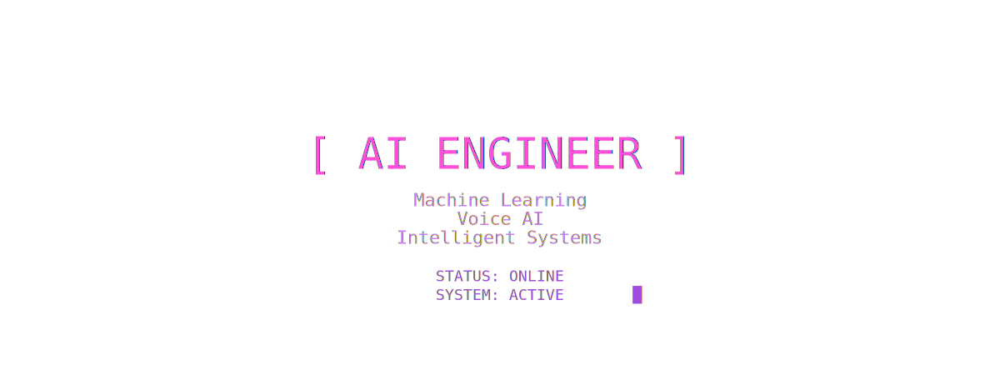

# 👋 Hello World!!, This is  Ajay Rajan A

<!-- 1. Profile Banner -->
<!-- 1. The Container must be 'relative' -->

  
  <!-- 3. The Overlay (Must be 'absolute' to sit on top) -->
  

---

<!-- 3. About Me -->
# 🧠 About Me

🚀 **AI Engineer** dedicated to building real-world solutions that scale. I specialize in **Intelligent Systems** with a focus on Healthcare, Agriculture, and Smart Cities.

- 🔬 Passionate about **Scalable AI Architecture**
- 🤖 Building **AI Agents, Voice Assistants & ML Pipelines**
- 🌍 Focused on **tech-driven social impact**
- 🏆 Hackathon Builder & Tech Community Contributor

---

<!-- 4. Tech Stack -->
# 🛠 Tech Stack

### 💻 Languages

)

### 🤖 AI / ML

### ⚙️ Backend & Cloud

---

<!-- 5. Featured Projects -->
# 🚀 Featured Projects

<table border="0">
  <tr>
    <td width="50%">
      <h3>🚦 AI Traffic Management</h3>
      
Computer Vision powered smart traffic optimization.

      
<b>Tech:</b> Python • OpenCV • Machine Learning

    </td>
    <td width="50%">
      <h3>🐄 GauConnect 2.0</h3>
      
AI + Blockchain platform to protect indigenous cattle breeds.

      
<b>Tech:</b> AI • Blockchain • Firebase

    </td>
  </tr>
  <tr>
    <td width="50%">
      <h3>🎤 Voice AI for Farmers</h3>
      
Multilingual conversational AI helping farmers get advice.

      
<b>Tech:</b> Gemini API • NLP • STT/TTS

    </td>
    <td width="50%">
      <h3>🧠 MedPro</h3>
      
AI-powered mental health platform for students.

      
<b>Tech:</b> AI Chatbot • React • Firebase

    </td>
  </tr>
</table>

---

<!-- 6. GitHub Stats -->
# 📊 Statistics

  
  
  <!-- 7. Top Languages -->
  

  <!-- 8. Contribution Streak -->
  
  
  <!-- 9. Activity Graph -->
  

---

<!-- 10. Current Focus -->
# 🌱 Currently Building

🚀 **AI Middleware System** – Scalable infrastructure for LLM deployments.  
🤖 **Conversational Agents** – Multi-modal AI for enterprise automation.  
📊 **Real-time ML Pipelines** – High-throughput data processing.

---

<!-- 11. Open Source Collaboration -->
# 🤝 Let's Collaborate

I am always looking for exciting opportunities to contribute to the community!

- 💡 **Open Source Projects** related to AI/ML and Social Impact.
- 🔬 **AI Research** and experimental implementations.
- 🏆 **Hackathons** and collaborative building.

---

<!-- 12. Connect With Me -->
# 📫 Connect With Me

  
  
  

  🌟 <i>If you like what I do, feel free to star my repositories!</i> 🌟

