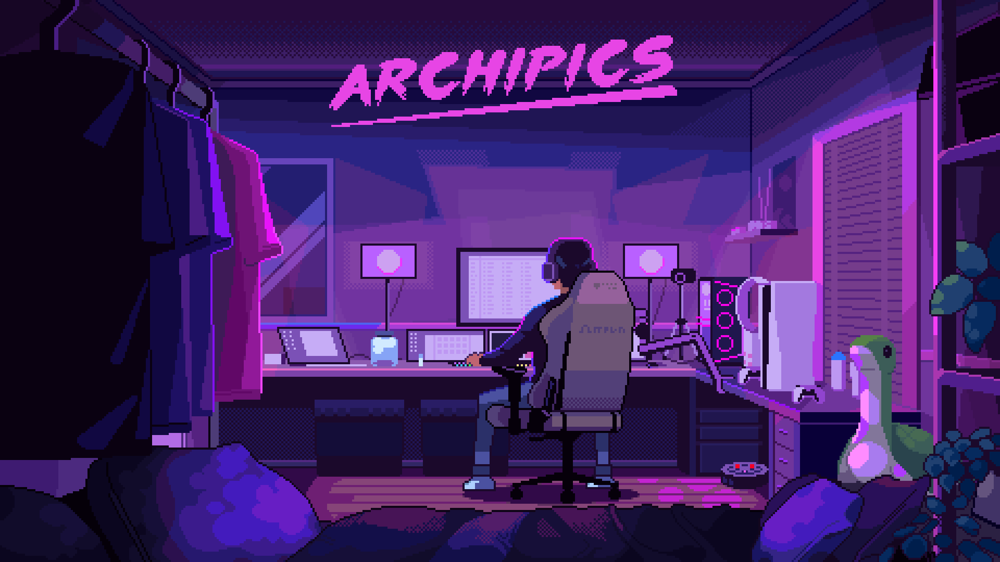

# 👋 INITIALIZING AI ENGINEER PROFILE

<!-- CYBERPUNK HEADER -->

<p align="center">

</p>

---

<!-- MATRIX DIVIDER -->

<p align="center">

</p>

---

# 🧠 BOOT SEQUENCE

```bash
> Starting system...
> Loading developer profile...
> AI modules detected
> Status: ONLINE
```

---

# ⚡ SYSTEM USER

## Ajay Rajan A

**AI Engineer | Intelligent Systems Architect**

Building **next-generation AI systems** combining:

• Machine Learning
• Voice AI
• Autonomous Agents
• Intelligent Infrastructure

Focused on **real-world AI impact** in:

⚕️ Healthcare
🌾 Agriculture
🏙 Smart Cities

---

# 🖥 TERMINAL STATUS

```yaml
System Status: ONLINE
Primary Language: Python
Specialization: Intelligent Systems
Focus Areas:
  - AI Infrastructure
  - Voice AI
  - Autonomous AI Agents
```

---

# ⚡ AI SYSTEM MODULES

| Module              | Description                       |
| ------------------- | --------------------------------- |
| 🧠 AI Agents        | Autonomous reasoning systems      |
| 🎤 Voice AI         | Natural conversational interfaces |
| ⚙ AI Infrastructure | Scalable ML pipelines             |
| 🔬 AI Research      | Autonomous research systems       |

---

# 🚀 FEATURED AI SYSTEMS

<table>
<tr>
<td width="50%">

## 🧠 AI Research Platform

Autonomous AI research system that explores scientific literature.

**Capabilities**

• Literature discovery
• Research summarization
• Citation graph generation
• Knowledge extraction pipelines

⭐ **Stars:** 

</td>
<td width="50%">

## 🧩 MindGraph OS

AI-powered system for understanding large codebases.

**Capabilities**

• Repository intelligence
• Knowledge graph generation
• Code structure analysis
• Technical debt detection

⭐ **Stars:** 

</td>
</tr>

<tr>
<td width="50%">

## 🎤 VoiceOS

Voice-driven operating system interface.

**Capabilities**

• Voice command execution
• LLM reasoning layer
• Speech-to-text pipelines
• Secure automation

⭐ **Stars:** 

</td>

<td width="50%">

## 🛡 Aegis Learn

AI-powered adaptive learning platform.

**Capabilities**

• Personalized learning paths
• AI tutor agents
• Knowledge evaluation engine

⭐ **Stars:** 

</td>
</tr>
</table>

---

# 🛠 TECHNOLOGY STACK

### 💻 Languages


---

### 🤖 AI / ML


---

### ⚙ AI Infrastructure


---

# 📊 SYSTEM TELEMETRY

<p align="center">


</p>

---

# ⚡ CONTRIBUTION ACTIVITY

<p align="center">


</p>

---

# 📈 AI NETWORK ACTIVITY

<p align="center">


</p>

---

# ⚡ CURRENT OPERATIONS

```yaml
Current Focus:
  - Autonomous AI Research Systems
  - Voice-driven AI Interfaces
  - AI Infrastructure Platforms
  - Intelligent Code Analysis Systems
```

---

# 🤝 CONNECT TO NETWORK

<p align="center">

<a href="https://linkedin.com/in/ajayrajan05">

</a>

<a href="https://ajayrajanportfolio.vercel.app">

</a>

<a href="mailto:ajayrajan727@gmail.com">

</a>

</p>

---

<p align="center">

⚡ **Building the Future of Intelligent Systems**

</p>
